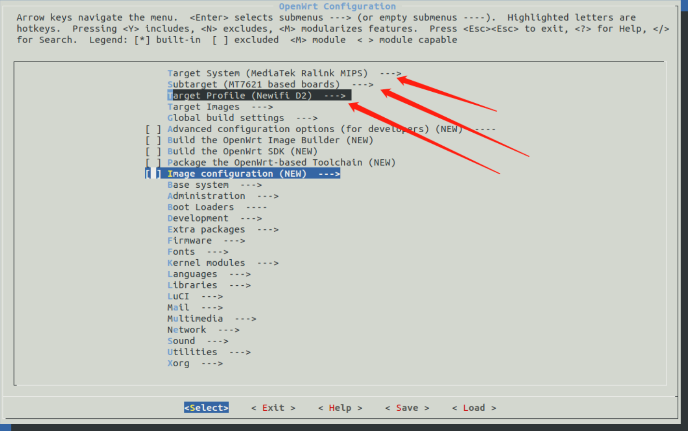
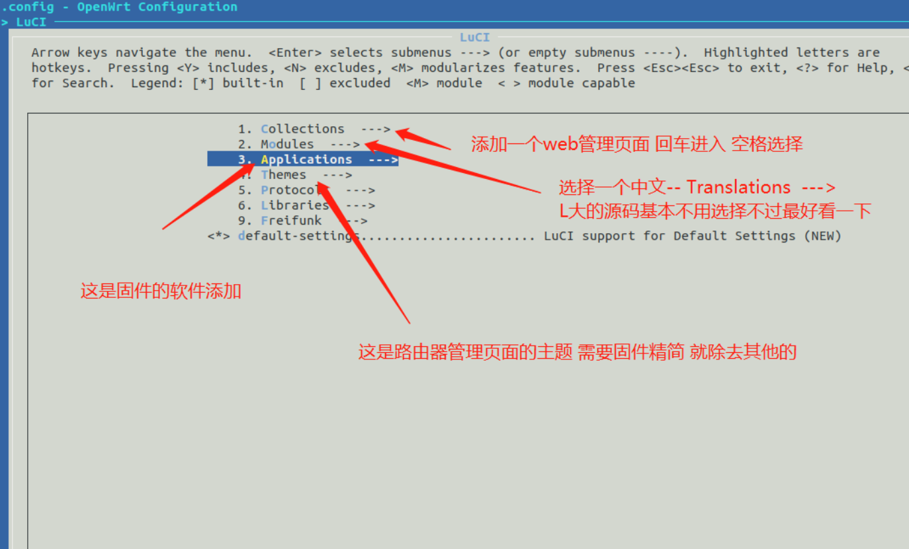
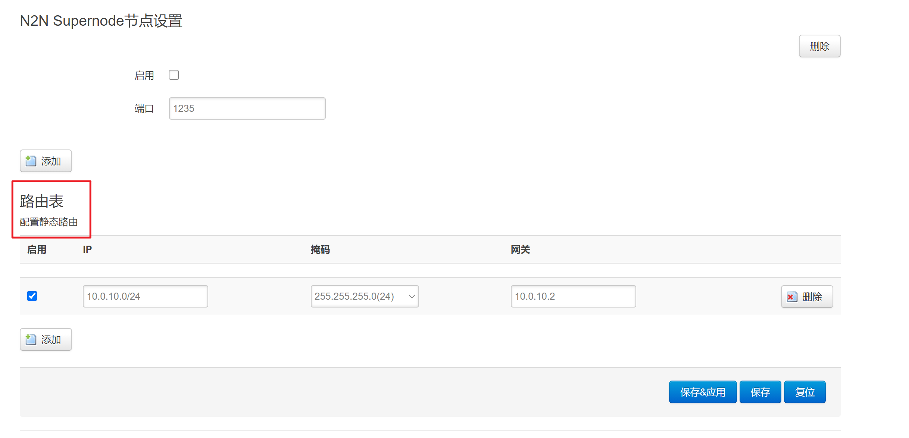

# actions-openwrt-passwall
- **感谢** 
  - [P3TERX/Actions-OpenWrt](https://github.com/P3TERX/Actions-OpenWrt) 
  - [Lienol/openwrt](https://github.com/Lienol/openwrt)
  - [Lean](https://github.com/coolsnowwolf/lede)


## Learn more about build Openwrt

- 本Action最初来自P3TERX，因此相关使用说明也可以具体参考P3TERX的博客[中文教程](https://p3terx.com/archives/build-openwrt-with-github-actions.html)
- [OpenWrt MenuConfig设置和LuCI插件选项说明](https://mtom.ml/827.html)


## How to use this repo

1. 仓库根目录目前有两个 DIY 脚本：`diy-part1.sh` 和 `diy-part2.sh`，它们分别在更新与安装 feeds 的前后执行，你可以把对源码修改的指令写到脚本中，比如修改默认 IP、主机名、主题、添加 / 删除软件包等操作。但不仅限于这些操作，发挥你强大的想象力，可做出更强大的功能。
2. 直接看下workflow文件的定义就大概知道流程了，在此不再多做说明。
3. workflow中的相关环境变量如下：

> **TIPS:** 修改时需要注意`:`(冒号)后面有空格。

| 环境变量             | 功能                                                        |
| :------------------- | :---------------------------------------------------------- |
| `REPO_URL`           | 源码仓库地址                                                |
| `REPO_BRANCH`        | 源码分支                                                    |
| `FEEDS_CONF`         | 自定义`feeds.conf.default`文件名                            |
| `CONFIG_FILE`        | 自定义`.config`文件名                                       |
| `DIY_P1_SH`          | 自定义`diy-part1.sh`文件名                                  |
| `DIY_P2_SH`          | 自定义`diy-part2.sh`文件名                                  |
| `UPLOAD_BIN_DIR`     | 上传 bin 目录。即包含所有 ipk 文件和固件的目录。默认`false` |
| `UPLOAD_FIRMWARE`    | 上传固件目录。默认`true`                                    |
| `UPLOAD_COWTRANSFER` | 上传固件到奶牛快传。默认`false`                             |
| `UPLOAD_WERANSFER`   | 上传固件到 WeTransfer 。默认`false`                         |
| `UPLOAD_RELEASE`     | 上传固件到 releases 。默认`false`                           |
| `TZ`                 | 时区设置                                                    |


## Tips


1.  现配置中，路由器默认IP为192.168.123.1，账号密码为root/password

2. “files 大法”是把你自定义的配置编译到固件里。这样升级或恢复出厂设置都不需要保留配置，缺省值就是自定义的配置。

   ​	a. 如你现在的network设置编译进固件：首先提取路由固件下的\etc\config\network 然后在项目根目录下创建files目录并push 到 \files\etc\config\network ，最后编译出来的固件就是现在设置的network。

   ​	b. 另外如果，使用“files 大法”仓库最好设为私有，否则你的配置信息，如宽带账号等会公开在网上。

3. 本Repo的action配置了上传.config 文件的功能，编译完成后可以到release里看到对应的此次编译配置

4. 若想使用自己的.config文件编译，需要修改 workflows/Build-Newifi3-d2.yml中env > CONFIG_FILE 为你的自命名.config文件

5. Lienol's openwrt  仓库 的 `19.07` 分支为平稳版，默认带有passwall 源码。

6. 若你想更换openwrt的源码，可以修改workflows下面的具体yml中的env（环境变量)。推荐使用[Lienol]()或者[Lean](https://github.com/coolsnowwolf/lede.git)

7. 在 Actions 页面等待执行到`SSH connection to Actions`步骤，会出现下面信息(若你配置SSH connection to Actions值为true)：  

   ```
   To connect to this session copy-n-paste the following into a terminal or browser:
   ssh Y26QeagDtsPXp2mT6me5cnMRd@nyc1.tmate.io
   https://tmate.io/t/Y26QeagDtsPXp2mT6me5cnMRd
   TIPS: Run 'touch /tmp/continue' to continue to the next step
   ```

   - 复制 SSH 连接命令粘贴到终端内执行，或者复制链接在浏览器中打开使用网页终端

   - 在终端中执行 `cd openwrt && make menuconfig`，而后配置你想要定制的内容。

     - 选择目标系统----新3为例------------ Target System (MediaTek Ralink MIPS)  --->  

     - 选择处理器型号----新3为例------------Subtarget (MT7621 based boards)  ---> 

     - 选择路由品牌----新3为例------------Target Profile (Newifi D2)  --->

       

       [插件说明参考](https://www.right.com.cn/forum/thread-344825-1-1.html)

       

     - 
   
  8. openwrt中的n2n默认使用的加密算法为twofish,因此n2n的其他节点都需要使用该种加密算法,即在edge启动时使用-A2参数。（注意加密算法在openwrt的界面上无法更改)

  9. 在web页面配置n2n的路由规则无法生效，需要在命令行手动配置路由

     
     
     10. 该固件内置了多种v\*n,因此结合passwall，当客户端连接上v\*n后，客户端即可穿越我华夏局域网（需要将路由v*n地址做为客户端的网关)

## Others


```
1. https://github.com/z826540272/passwall-openwrt
2. https://github.com/Hyy2001X/AutoBuild-Actions  对应的论坛地址为： https://www.right.com.cn/forum/forum.php?mod=viewthread&tid=4047888&extra=page%3D1%26filter%3Dlastpost%26orderby%3Dlastpost
3. 多流程编译移步[Actions-Lean-OpenWrt](https://github.com/Lancenas/Actions-Lean-OpenWrt)
```
